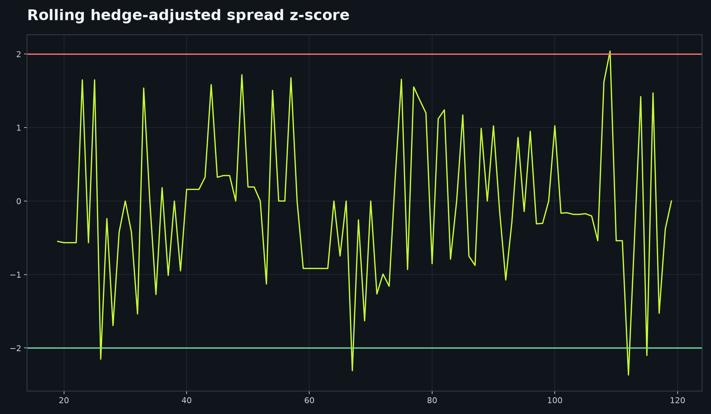

# Pairs Trading System



Research cointegrated equity pairs, model a hedge-adjusted spread, and route proposed orders only to Alpaca paper trading or dry-run output.

## Workflow

`prices -> cointegration screen -> OLS hedge ratio -> rolling z-score -> bounded entry/exit signals`

```bash
pip install -e . pytest ruff
pairs-trading --left KO --right PEP
pytest && ruff check . && ruff format --check .
```

The adapter refuses non-paper endpoints. Market data may be unavailable; the pure research and payload tests run offline.

## Limitations and disclaimer

Cointegration can break down and a backtest cannot establish tradability, fill quality, or profitability. This project is intended for educational and research purposes only. It does not provide investment advice, and its outputs should not be used as the sole basis for financial decisions. Historical performance and simulated results do not guarantee future performance.

MIT License. Author: Aarav Shah.
